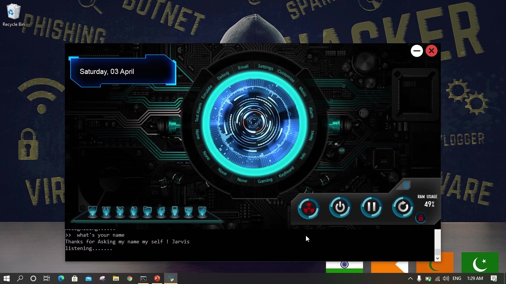

# J.A.R.V.I.S. LIKE DVA 
## USING Python 3.9 & PyQt5 framework for GUI

## STEPS TO PERFORM
### 1.First you need to have Python 3.9.2 64 bit install on your computer
### 2.Than you need to open command line interface in the project folder
### 3.After that you need to create python virtual environment onthe same directory
#### code for creating virtual enviroment: 
    python -m venv jarvisenv
### 4.Than you need to activate virtual environment : 
    jarvisenv/scripts/activate
### 5.Enter requirements.bat it will automatically install all the python library
### 6.Last step enter run.py (it will run the python file)
